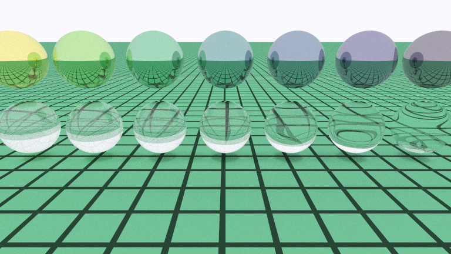

# CPUPathTracing

CPU path tracing renderer built with C++ and CMake. Supports model loading, BVH acceleration, and multiple materials.

## Build

```powershell
git clone --recurse-submodules https://github.com/foreverywy-fys/CPUPATHTRACING.git
cmake -S . -B build
cmake --build build --config Release
```

## Render Example

Render output from `material.ppm`:



Original image: [material.ppm](material.ppm)
